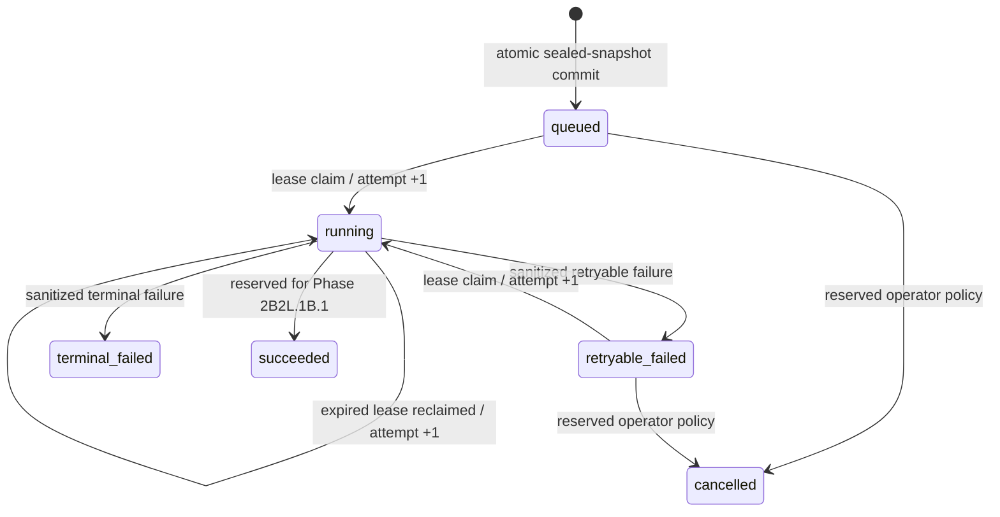

# Baseline repository registration and sealed continuation

This document freezes the Phase 2B2L.1B.0 Core boundary. It does not define a
CLI upload command, reconstruct staged content, create a corpus generation, or
start an index or baseline run.

The existing authorization model is sufficient: a group administrator is a
current authenticated user with a durable `administrator` record related to
the target group through `admin_to_group`, and the user must also remain in
`user_to_group`. Request fields never establish either relationship.

## Trust and authorization boundary

Repository authorization is an administrator-created, group-scoped mapping.
Its public handle is an opaque UUID `registration_id`; a manifest's
`repository_id` must equal that handle. The immutable identity descriptor is:

```json
{
  "version": "repository-identity.v1",
  "authority": "git.example.test",
  "repository_uid": "provider-stable-repository-id"
}
```

`authority` is a normalized lowercase authority label and `repository_uid` is
the stable identifier assigned by that authority. Neither is a local checkout
path. Core stores the RFC 8785/JCS SHA-256 of this exact descriptor as well as
the descriptor fields. The compatibility columns on the earlier staging
registration table contain the opaque registration UUID, not a request name or
path.

The manifest's repository name and immutable Git revisions remain asserted
snapshot metadata. They do not create, modify, or reactivate a registration.
The changed repository registration additionally has a nullable authoritative
`source_document_id` relationship; begin, part upload, commit, and downstream
claim require that document to remain in the selected group.

Only a current group administrator may create, disable, or reactivate a
registration. An ordinary current group member may stage a snapshot using
already active registrations. Every begin, content-part, commit, and claim
reauthorizes the current user, group, active registrations, and changed source
scope. Disabling a registration blocks new work and claims but retains its
descriptor and existing audit rows.

## HTTP and service contracts

All HTTP operations are authenticated POST requests, use the strict bounded
UTF-8 JSON parser, and require the transport rules in
`baseline-control-plane-deployment.md`. Selectors are in bodies, never URL
query strings.

### Create or replay a registration

`POST /baseline/control/admin/v1/repositories/register`

```json
{
  "schema_version": "baseline-repository-registration-admin.v1",
  "message_type": "repository_registration_create",
  "request_id": "uuid",
  "group_id": "group-id",
  "identity_descriptor": {
    "version": "repository-identity.v1",
    "authority": "git.example.test",
    "repository_uid": "provider-stable-repository-id"
  },
  "source_document_id": null
}
```

The response contains only schema/message/request/group, opaque
`registration_id`, `identity_descriptor_hash`, `state`, and `replayed`.
The same group and descriptor replays the stable registration. A different
source-document binding conflicts. Extra fields such as local paths, display
names, or revisions are rejected.

### Change registration state

`POST /baseline/control/admin/v1/repositories/state`

```json
{
  "schema_version": "baseline-repository-registration-admin.v1",
  "message_type": "repository_registration_state",
  "request_id": "uuid",
  "group_id": "group-id",
  "registration_id": "uuid",
  "active": false
}
```

This is idempotent. Both disabling and reactivation require current group-admin
authorization.

### Read continuation state

`POST /baseline/control/v1/continuations/status`

```json
{
  "schema_version": "baseline-snapshot-continuation.v1",
  "message_type": "continuation_job_status_request",
  "request_id": "uuid",
  "group_id": "group-id",
  "staging_job_id": "uuid-or-null",
  "continuation_job_id": null
}
```

Exactly one job selector is non-null. The response contains the distinct
staging and continuation job IDs, operation `sealed_snapshot_continue`, state,
attempt number, timestamps, safe snapshot/count summaries, sanitized error
code, and explicit `corpus_eligible=false` and `index_eligible=false`. It never
contains the idempotency key, descriptor, manifest, diff, file content, query,
lease token, credential, or path.

The frozen `baseline-control-plane.v1` protocol bytes and SHA-256 are unchanged.
Its existing snapshot begin/part/commit and staging job-status messages remain
the staging contract. The admin and continuation-status messages are separate
Core-only versioned contracts until the future CLI phase explicitly adopts
them.

### Internal worker commands

No public worker endpoint or task exists in this phase. The server-side service
offers:

- `claim_continuation_job(caller_user_id, group_id, job_id, lifetime)`;
- `record_continuation_failure(caller_user_id, group_id, job_id, lease_token,
  error_code, retryable)`; and
- `expire_staging_sessions()` for open staging expiry.

A claim returns the continuation ID, an opaque lease token, expiry, and attempt
number. The token is never returned by status. The error code accepts only a
bounded safe identifier and is persisted with its SHA-256 fingerprint.

## Sealing and idempotency

Commit validates the ordered part descriptors and counts, changes the staging
job to succeeded, seals the staging snapshot, and creates the continuation in
the same transaction. The staging job is never reopened or reinterpreted.
Sealed manifest identity, received totals, content-manifest hash, timestamps,
and parts are protected by database triggers in SQLite and PostgreSQL. The
nullable source-document provenance pointer may become `NULL` on source
deletion without rewriting the sealed evidence.

The continuation reuses the staging request's opaque idempotency key but has a
new UUID. Its JCS `sealed_intent_hash` covers contract version, group, staging,
snapshot and manifest hashes, opaque repository-set hash, and all expected
counts. Same key plus identical intent returns the same continuation. Any
different staging or sealed intent is `continuation_conflict` and rolls back.

Before a claim, Core reads only the sealed manifest and ordered part
descriptors. It revalidates active repository registrations, user/group/source
authorization, all immutable hashes and counts, and the continuation contract.
It does not decode or combine `content_utf8`, construct `CorpusSnapshotInput`,
or write corpus/index state.

## State model



Phase 2B2L.1B.0 implements creation, claim/reclaim, and failure transitions.
It deliberately has no success transition because no corpus ingestion occurs.

## Migration and deletion semantics

Migration `0006_baseline_control_plane_continuation_v1` is additive and runs
after `0005_baseline_control_plane_staging_v1`. It creates:

- `baseline_control_repository_approval`;
- `baseline_snapshot_continuation_job`; and
- registration, descriptor, sealed-staging, and continuation immutability
  triggers.

Existing 0005 registrations are not silently approved; an administrator must
provision an approved descriptor. Group deletion cascades registrations,
approvals, staging, parts, staging jobs, and continuations. User deletion sets
approval/continuation audit user pointers to `NULL`. Source document deletion
sets registration and staging provenance pointers to `NULL`, preserves sealed
content and continuation audit, and prevents a new claim. Registration disable
does not delete anything. There is no general sealed-snapshot cleanup or
registration-delete API in this phase. Open expired staging is marked expired;
an unexpired active lease defers that cleanup.

Neither table references corpus generations or index publications. Row
existence and a sealed state are therefore insufficient to make content
eligible.

## Phase 2B2L.1B.1 implementation

Phase 2B2L.1B.1 is implemented by the internal worker described in
`baseline-control-plane-ingestion-worker.md`. It preserves this sealed input
and provides:

1. A trusted internal worker identity/execution policy that reauthorizes the
   stored originating user, group, source, and repository registrations at
   claim and completion.
2. Lease-token-guarded success, retry, terminal-failure, and cancellation
   transitions, with additive durable value-only provenance for the resulting
   active corpus generation.
3. Ordered part loading, strict JSON/JCS decoding, per-item hash/size/path/state
   validation, and exact reconstruction into the existing typed
   `CorpusSnapshotInput` contract.
4. A call to the existing secure corpus-ingestion service only after the full
   sealed snapshot has been reconstructed and revalidated. No partial
   generation may activate.
5. Transactional failure injection, concurrent worker, expired-lease,
   authorization-revocation, source-deletion, restart, SQLite, and real
   PostgreSQL tests.
6. Explicit retention policy for terminal and abandoned staging; this phase
   intentionally provides no destructive sealed-audit purge.

Index build, baseline execution, generation, notification delivery, CLI upload,
and legacy behavior remain outside that worker phase.
