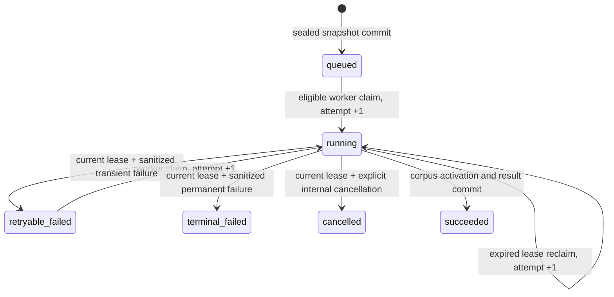

# Baseline sealed-snapshot ingestion worker

Phase 2B2L.1B.1 adds one internal continuation worker. It accepts only an
opaque `group_id` and continuation job ID from its scheduler. It has no HTTP
endpoint, Celery payload, CLI command, repository scanner, filesystem reader,
or URL dereference behavior.

The execution identity is `compair-core-corpus-ingestion` under contract
`baseline-continuation-worker.v1`. The identity marks a trusted Core process
boundary; it is not an end-user authorization bypass. Every claim and every
publication transaction reauthorizes the user stored on the sealed
continuation, requires that user to remain active and in the group, requires
the changed source document to remain in the group, and recomputes every
active registered-repository descriptor hash. No endpoint accepts the worker
identity or a lease token.

## Reconstruction contract

Only a leased `running` continuation can be reconstructed. The worker reloads
the sealed canonical manifest and content parts from the database and checks:

- control-plane version, snapshot ID, JCS manifest hash, sealed intent hash,
  repository-set hash, and all declared counts;
- repository approval state and the immutable registered descriptor identity;
- changed repository, base/head and sibling revisions, and source-document
  scope, without dereferencing the descriptor authority, a URL, or a path;
- consecutive part ordinals, part JCS hashes, ordered file ordinals, content
  manifest hash, item/byte totals, strict UTF-8 and JSON, duplicate JSON keys,
  per-item byte sizes and SHA-256 values, and complete supported-file coverage;
- normalized manifest paths and typed supported/skipped states by reusing the
  existing control-plane validators; and
- the existing `CorpusSnapshotInput` and `CorpusFileInput` validators before
  any corpus write.

The resulting trusted input uses `group:<group_id>` as the existing baseline
corpus scope, the sealed snapshot ID as its deterministic generation version,
the changed head revision as source revision, and the control manifest hash as
source-manifest provenance. Unsupported inputs without a declared SHA-256 fail
closed because the existing trusted corpus contract never invents a content
hash.

The registered descriptor remains identity-only. The worker never fetches a
remote, opens a checkout, follows a symlink, or tries to prove Git ancestry by
network access. Base/head consistency and immutable object-ID syntax are
revalidated from the sealed declaration.

## State and transaction model

Claim/reclaim uses a compare-and-set state/expiry predicate. Failure,
cancellation, and success updates require the current opaque lease token; a
stale or expired worker cannot transition the row. Tokens and worker instance
IDs are never returned by status.

Corpus publication is successful only when one database transaction has both:

1. atomically activated the completely validated trusted corpus generation,
   superseding the prior active generation; and
2. changed the same continuation from the current leased `running` state to
   `succeeded` with its safe result fields.

`CorpusIngestionService.ingest_resumable` is the existing ingestion service's
durable-job entry point. It resumes only the same scope, deterministic
generation version, complete file rows, and byte-identical trusted metadata.
Its publication callback shares the activation transaction. A callback,
authorization, lease, or injected database failure rolls back activation and
retains the prior active generation. A crash after commit observes both the
active generation and `succeeded`; a crash before commit observes neither.

The staged generation and its `RetrievalIndexState` are created by the existing
corpus lifecycle. On success the index state must still be `incomplete`.
Neither an index build nor a baseline run is created, and baseline retrieval
therefore remains fail closed.

## Safe durable result and status

Migration `0007_baseline_control_plane_ingestion_worker_v1` adds these
value-only fields to `baseline_snapshot_continuation_job`:

- `result_corpus_id`;
- `result_generation_id`;
- `result_generation_version`;
- `result_manifest_hash`;
- `result_provenance_fingerprint`;
- `result_worker_contract_version`; and
- `result_published_at`.

They deliberately have no foreign keys to mutable corpus/index lifecycle rows,
so the sealed audit does not disappear through later corpus retention. Database
triggers require the complete set exactly for `succeeded` and make it immutable
afterward. The provenance fingerprint is JCS SHA-256 over safe IDs, sealed
hashes, worker contract, and result IDs/hashes. It includes no manifest JSON,
content, raw diff, query, idempotency key, descriptor, credential, endpoint, or
path.

Authorized continuation status may return those fields, the successful corpus
ingestion state, and `index_state=incomplete`. It always returns
`index_eligible=false` and `baseline_eligible=false`. Frozen
`baseline-control-plane.v1` capability bytes and SHA-256 are unchanged;
`corpus_ingestion`, `index_build`, and `baseline_run` remain `unavailable` on
that external protocol.

Errors persist only a bounded identifier and its SHA-256. Arbitrary exception
text and stack traces are excluded. The worker module does not log source
values.

## Retention and sealed immutability

The migration also prevents insert or delete of content parts after a staging
session is sealed; the prior update guard remains in force. Failed, cancelled,
expired-lease, and succeeded continuations retain their sealed staging rows and
parts as audit history. Existing open-staging expiration still defers while an
active lease exists. This phase adds no general purge: an authorized future
retention job must first prove that the sealed input and safe continuation
result are no longer required, and must never delete through an active lease.
Group deletion retains the existing stronger privacy cascade.

## Phase 2B2L.1C compatible-index job prerequisites

The next phase must be a separate durable job, not another continuation state:

1. Add a group-scoped index-build job and opaque idempotency intent bound to
   the succeeded continuation's corpus/generation, trusted ingestion manifest,
   and still-active generation.
2. Reauthorize user/group/source/repository scope at submit, claim, and
   publication, and reject a stale or deleted generation.
3. Attest the configured production embedding provider/model/revision/dimension
   before claim and again before publication; carry no document text in job
   status or task metadata.
4. Invoke the existing durable lexical/dense index builder with lease-guarded
   retry/reclaim and an atomic compatible-publication callback.
5. Persist only safe index/publication/fingerprint fields; keep the prior
   compatible publication on every failure.
6. Add SQLite and real PostgreSQL migration, concurrency, crash, restart,
   stale-generation, embedding mismatch, and rollback tests.

CLI upload/scanning, baseline run submission, generation, notifications, and
all legacy behavior remain out of scope.
